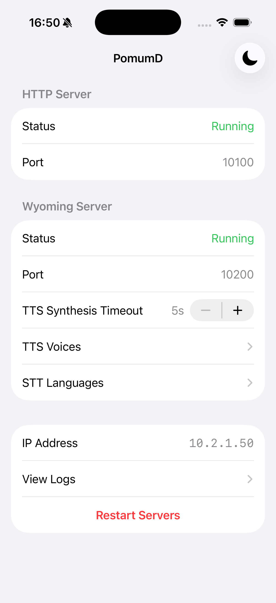
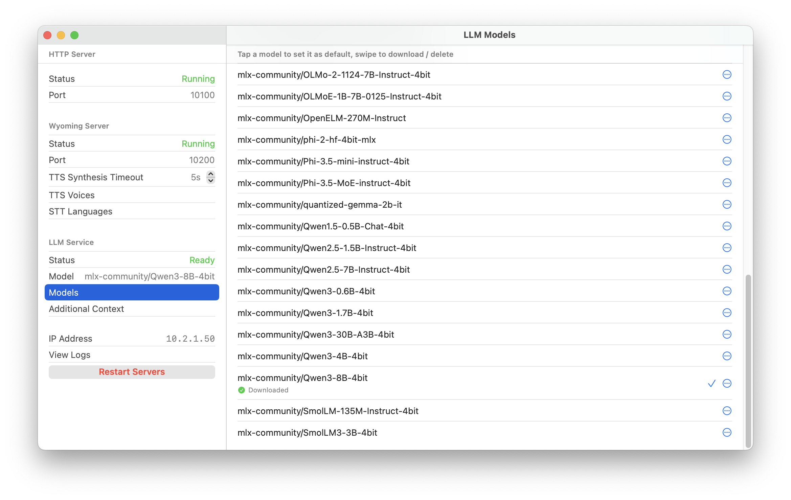

# PomumD

> [!IMPORTANT]
> This project is in very early development stage, expect many breaking changes and bugs.

[Wyoming Protocol](https://github.com/OHF-Voice/wyoming) text-to-speech (TTS) and speech-to-text (STT) server using iOS AVFoundation and Speech frameworks, and OpenAI Conversation API-compatible LLM server, on-device processing only.

Runs on iOS/iPadOS 17.0+ and macOS 14.0+ devices (iOS/iPadOS 16.0+ and macOS 13.0+ for the lite version without LLM)

## Text-to-Speech

[AVSpeechSynthesizer](https://developer.apple.com/documentation/avfaudio/avspeechsynthesizer) of AVFoundation framework.

- Support over 60 languages available in [Spoken Content](https://www.apple.com/ios/feature-availability/#accessibility-voiceover) (depending on OS version), with all the available voices (compact, enhanced, premium), except Siri voices.

> [!NOTE]
> _Keep in mind that although Siri voices are available to be selected in Spoken Content Settings, they are not available through the AVSpeechSynthesizer API._ (https://developer.apple.com/videos/play/wwdc2020/10022/?time=213)

- Support a subset of SSML tags, no documentation available from Apple yet, some tags will crash the synthesizer (`EXC_BAD_ACCESS`) on certain OS versions (e.g., macOS 15.7.3).

- Support Wyoming TTS streaming mode. The input text is chunked into sentences automatically using [NLTokenizer](https://developer.apple.com/documentation/naturallanguage/nltokenizer) provided by the Natural Language framework; or chunked by first-level tags when SSML is used.

## Speech-to-Text

For iOS/iPadOS/macOS 26.0+: [SpeechTranscriber](https://developer.apple.com/documentation/speech/speechtranscriber) of Speech framework.

For others: [SFSpeechRecognizer](https://developer.apple.com/documentation/speech/sfspeechrecognizer).

- Support over 60 languages available in [Dictation](https://www.apple.com/ios/feature-availability/#dictation) (depending on OS version).

## LLM Chat

[MLX Swift LM](https://github.com/ml-explore/mlx-swift-lm).

> [!NOTE]
> Not available in the lite version targeting iOS 16.0+ and macOS 13.0+ due to the mlx-swift-lm package [requirements](https://github.com/ml-explore/mlx-swift-lm/blob/57f2fe7720730236e7a3ba5acd820aa53bae6d18/Package.swift#L8-L13).

- Support OpenAI Conversation API for using with [Home LLM](https://github.com/acon96/home-llm) integration.
- For a list of supported models, see [LLMRegistry](https://swiftpackageindex.com/ml-explore/mlx-swift-examples/2.29.1/documentation/mlxllm/llmregistry).

## Other Features

- HTTP health check endpoint at `/health`.
- Prometheus metrics endpoint at `/metrics`.
- Screensaver to prevent OLED burn-in.
- mDNS Zeroconf for Home Assistant auto discovery (`_wyoming._tcp.local.`).

## TODO

- [ ] Fix SSML validation to prevent crashes.
- [ ] On-device LLM using Foundation Models framework (iOS/iPadOS/macOS 26.0+ only).
- [ ] Support for other TTS and STT models using MLX.
- [ ] VLM and integration with LLM Vision.

## Screenshot

 
 

## Older Devices

The package `swift-prometheus` [requires iOS 16.0+ / macOS 13.0+](https://github.com/swift-server/swift-prometheus/blob/8a8ff47403444e16d8cdfa805a5e3cb8e2efe734/Package.swift#L20), its last version supports iOS 15 / macOS 12 is `1.0.2`, with some issues like [#70](https://github.com/swift-server/swift-prometheus/issues/70) and [#77](https://github.com/swift-server/swift-prometheus/issues/77). Otherwise, this app could run on those OS versions without problem, but the performance is not good from my tests on an iPhone 6s running iOS 15.7.3. Meanwhile, the performance on an iPhone 8 running iOS 16.7.2 is great.
